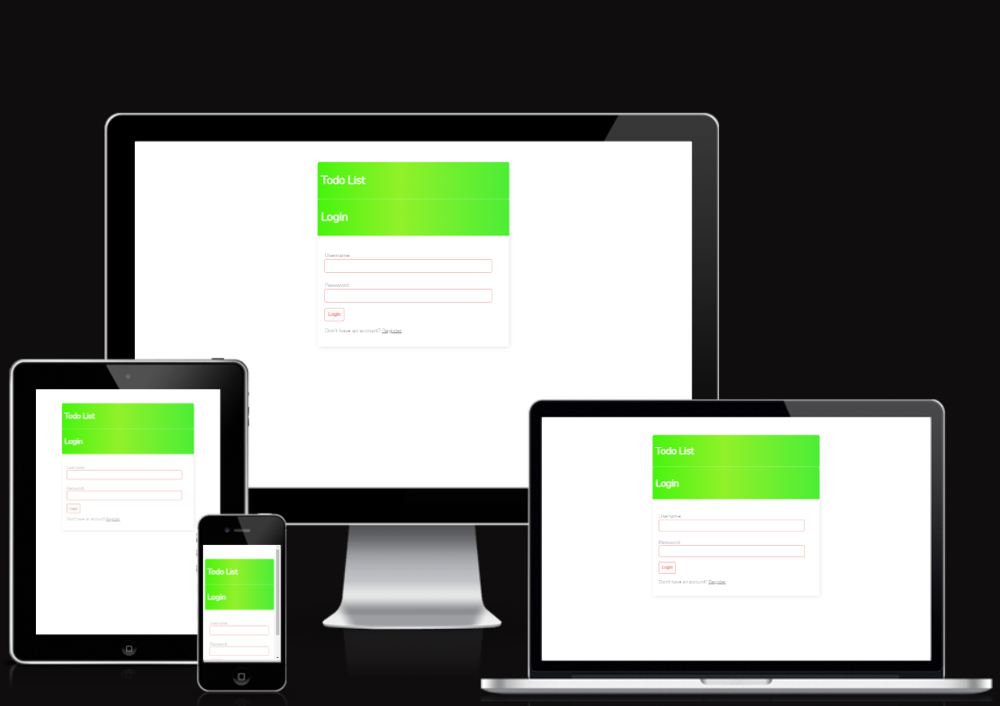

# Task Manager to-do list application

### The live website can be seen [here](https://mytodolist-applic.herokuapp.com/login/)

# UX
## Strategy 
### Agile
#### The Agile methodology was used to plan the project. Github was used as the tool to demonstrate this.
* Projects were used to create the project.
* Issues were used to create User Stories with a custom template. Eash user story is clearly described with a title, statement, acceptance criteria and tasks.
#### As work on a user story was begun the story was moved from the 'to do' column of the board to the 'In progress' column. When work on the story was complete the user story was moved into the 'done' column.

### Project Goal
#### The goal of the project is to create a Task Manager todo list application website. Inspiration for the site came from the developer's task manager group who requested a place to store the tasks for their regular meetings. The developer's family also wanted a means to store, edit and delete their own tasks. The target user is someone:
* who wants to store, edit and delete their own tasks in one place.

### User Stories
#### There are 5 User Stories. The User Stories are numbered so can be easily tracked. 
* User Stories: 
   * As a Site User I can register an account so that I can create my tasks.[#4](https://github.com/DublinSwords/TODO_LIST/projects/1#card-83891071)
   * As a Site User I can create, read, update and delete tasks so that I can manage my tasks content.[#5](https://github.com/DublinSwords/TODO_LIST/projects/1#card-83891125)
   * As a Site User I can click on a task so that I can read the full text.[#2](https://github.com/DublinSwords/TODO_LIST/projects/1#card-83890944)
   * As a Site User I can view the description on my account so that I can read the task description.[#3](https://github.com/DublinSwords/TODO_LIST/projects/1#card-83891033)
   * As a Site User I can view a list of tasks so that I can select one to read.[#1](https://github.com/DublinSwords/TODO_LIST/projects/1#card-83890832)

### Scope
#### The scope of the project was large at the planning stage. While the ultimate goal was to allow logged in users to have full CRUD functionality for all their own content, time constraints meant this was limited to CRUD functionality for users only for their own tasks . More functionality for logged in users will be added in the future. 

### Structure
#### The website consists of six pages: Registration, Main page, Add Task, Search task, View, Delete and Log In/Log Out pages. Log in and Registration can be viewed by all users. Task page is limited to logged in users.