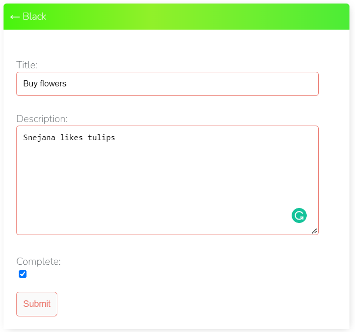
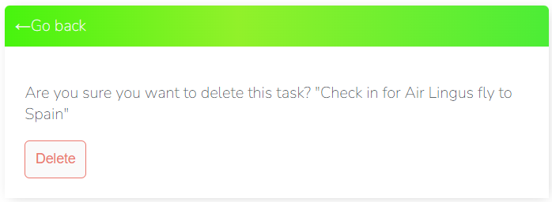
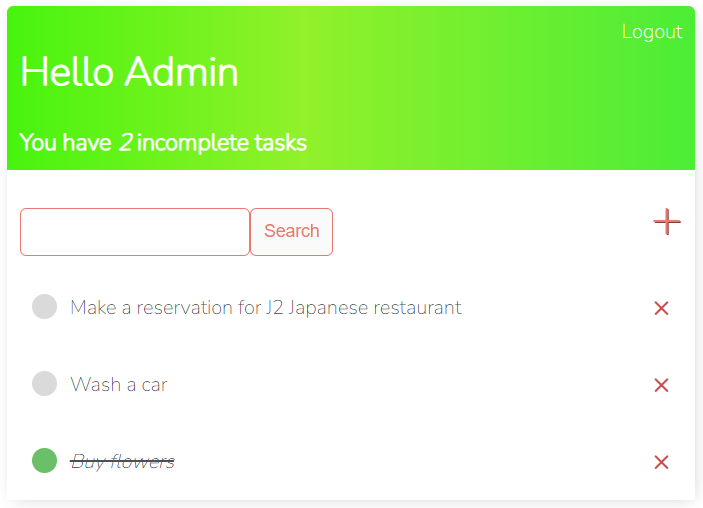

# Task Manager to-do list application

### The live website can be seen [here](https://mytodolist-applic.herokuapp.com/login/)

# UX
## Strategy 
### Agile
#### The Agile methodology was used to plan the project. Github was used as the tool to demonstrate this.
* Projects were used to create the project.
* Issues were used to create User Stories with a custom template. Eash user story is clearly described with a title, statement, acceptance criteria and tasks.
#### As work on a user story was begun the story was moved from the 'to do' column of the board to the 'In progress' column. When work on the story was complete the user story was moved into the 'done' column.

### Project Goal
#### The goal of the project is to create a Task Manager todo list application website. Inspiration for the site came from the developer's task manager group who requested a place to store the tasks for their regular meetings. The developer's family also wanted a means to store, edit and delete their own tasks. The target user is someone:
* who wants to store, edit and delete their own tasks in one place.

### User Stories
#### There are 5 User Stories. The User Stories are numbered so can be easily tracked. 
* User Stories: 
   * As a Site User I can register an account so that I can create my tasks.[#4](https://github.com/DublinSwords/TODO_LIST/projects/1#card-83891071)
   * As a Site User I can create, read, update and delete tasks so that I can manage my tasks content.[#5](https://github.com/DublinSwords/TODO_LIST/projects/1#card-83891125)
   * As a Site User I can click on a task so that I can read the full text.[#2](https://github.com/DublinSwords/TODO_LIST/projects/1#card-83890944)
   * As a Site User I can view the description on my account so that I can read the task description.[#3](https://github.com/DublinSwords/TODO_LIST/projects/1#card-83891033)
   * As a Site User I can view a list of tasks so that I can select one to read.[#1](https://github.com/DublinSwords/TODO_LIST/projects/1#card-83890832)

### Scope
#### The scope of the project was large at the planning stage. While the ultimate goal was to allow logged in users to have full CRUD functionality for all their own content, time constraints meant this was limited to CRUD functionality for users only for their own tasks . More functionality for logged in users will be added in the future. 

### Structure
#### The website consists of six pages: Registration, Main page, Add Task, Search task, View, Delete and Log In/Log Out pages. Log in and Registration can be viewed by all users. Task page is limited to logged in users.

### Existing Features

#### Login page - existing user can login. 

#### Registration page - a new user can create an account adding his/her name ans password. 

#### Main page - will show user's name and user can create, edit, view, delete, search and see how many incompleted tasks remain. The tasks which are completed will be marked with crossed out and green dot from the left handside. 

#### Search page - user can search for task typing in a first letter. 

#### Create a task page - user can create a task with "+" button. Title of task, description of task, complete button when task is complete, and submit button.  

#### View/Edit - when task is created we can add some description in description box. 

#### Complete - when task is complete we can mark as complete. 

#### Delete - when task is completed user can delete his task with "x" button from the right hand side. Before that it will appear a message - "Are you sure you want to delete this task?"

#### Main page - when user deleted his task, he will do not have it on the main page. 

## Future Features
  * A useful future feature would be to filter by the user's favourites.
  * User sign-in with Google/Facebooks
  * Images can be uploaded to the create task form from the user's own computer or via a url. This could be further restricted by size and type to ensure consistency.

# Design
### The design style of the website is minimalist, fresh and clean looking.
## Colours
  * The colours are chosen to convey nature, fresh clean and nutritious: orange, green, black and white.

  * Font colours are orange white, adjusted for contrast. 

## Typography
  * The fonts selected were: Nunito for the text and Raleway for the headings. These were selected for their simple and elegant style.

# Technologies Used
## Languages

  * [HTML5](https://en.wikipedia.org/wiki/HTML5) was used to build the front-end website
  * [CSS](https://en.wikipedia.org/wiki/CSS) was used to style the HTML and add responsiveness
  * [JavaScript](https://www.javascript.com/) (no custom JS) was used with Bootstrap to provide interaction on the front-end
  * [Bootstrap 5.1.3](https://getbootstrap.com/docs/5.0/getting-started/introduction/) was used to style the website, add responsiveness and interactivity
  * [Python](https://www.python.org/) was used to code the back end of the project
  * [PyPI](https://pypi.org/) to install the python packages

## Frameworks
  * [Django 3.2.8](https://docs.djangoproject.com/en/3.2/)
  * Django supporting libraries:
    * [gunicorn](https://gunicorn.org/) as the server for Heroku
    * [psycopg2](https://pypi.org/project/psycopg2/) as an adaptor for Python and PostgreSQL databases
    * [dj-database](https://pypi.org/project/dj-database-url/) to parse the database URL from the environment variables in Heroku

## Database

  * Heroku Postgres for the production database
  * SQLite for the local environment for automated testing

