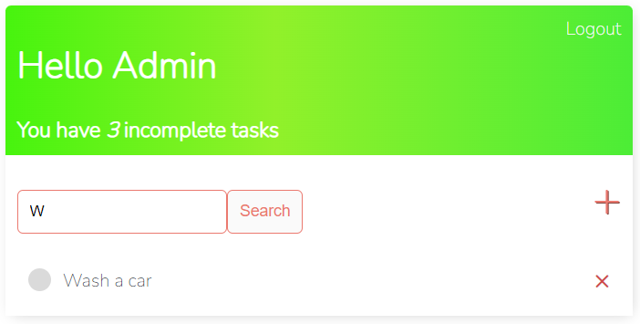
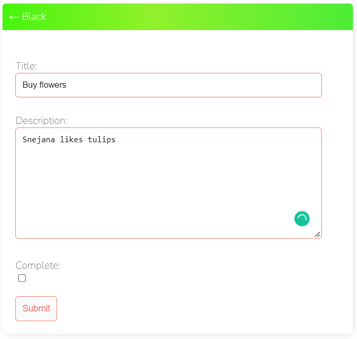

# Task Manager to-do list application

### The live website can be seen [here](https://mytodolist-applic.herokuapp.com/login/)

# UX
## Strategy 
### Agile
#### The Agile methodology was used to plan the project. Github was used as the tool to demonstrate this.
* Projects were used to create the project.
* Issues were used to create User Stories with a custom template. Eash user story is clearly described with a title, statement, acceptance criteria and tasks.
#### As work on a user story was begun the story was moved from the 'to do' column of the board to the 'In progress' column. When work on the story was complete the user story was moved into the 'done' column.

### Project Goal
#### The goal of the project is to create a Task Manager todo list application website. 
* who wants to store, edit and delete their own tasks in one place.

### User Stories
#### There are 5 User Stories. The User Stories are numbered so can be easily tracked. 
* User Stories: 
   * As a Site User I can register an account so that I can create my tasks.[#4](https://github.com/DublinSwords/TODO_LIST/projects/1#card-83891071)
   * As a Site User I can create, read, update and delete tasks so that I can manage my tasks content.[#5](https://github.com/DublinSwords/TODO_LIST/projects/1#card-83891125)
   * As a Site User I can click on a task so that I can read the full text.[#2](https://github.com/DublinSwords/TODO_LIST/projects/1#card-83890944)
   * As a Site User I can view the description on my account so that I can read the task description.[#3](https://github.com/DublinSwords/TODO_LIST/projects/1#card-83891033)
   * As a Site User I can view a list of tasks so that I can select one to read.[#1](https://github.com/DublinSwords/TODO_LIST/projects/1#card-83890832)

### Scope
#### The scope of the project was large at the planning stage. While the ultimate goal was to allow logged in users to have full CRUD functionality for all their own content, time constraints meant this was limited to CRUD functionality for users only for their own tasks . More functionality for logged in users will be added in the future. 

### Structure
#### The website consists of six pages: Registration, Main page, Add Task, Search task, View, Delete and Log In/Log Out pages. Log in and Registration can be viewed by all users. Task page is limited to logged in users.

### Existing Features

#### Login page - existing user can login. 

#### Registration page - a new user can create an account adding his/her name ans password. 

#### Main page - will show user's name and user can create, edit, view, delete, search and see how many incompleted tasks remain. The tasks which are completed will be marked with crossed out and green dot from the left handside. 

#### Search page - user can search for task typing in a first letter. 

#### Create a task page - user can create a task with "+" button. Title of task, description of task, complete button when task is complete, and submit button.  

#### View/Edit - when task is created we can add some description in description box. 

#### Complete - when task is complete we can mark as complete. 

#### Delete - when task is completed user can delete his task with "x" button from the right hand side. Before that it will appear a message - "Are you sure you want to delete this task?"

#### Main page - when user deleted his task, he will do not have it on the main page. 

## Future Features
  * A useful future feature would be to filter by the user's favourites.
  * User sign-in with Google/Facebooks

# Design
### The design style of the website is minimalist, fresh and clean looking.
## Colours
  * The colours are chosen to convey nature, fresh clean and nutritious: green, black and white.

  * Font colours are orange white, adjusted for contrast. 

## Typography
  * The fonts selected were: Nunito for the text and Raleway for the headings. These were selected for their simple and elegant style.

# Technologies Used
## Languages

  * [HTML5](https://en.wikipedia.org/wiki/HTML5) was used to build the front-end website
  * [CSS](https://en.wikipedia.org/wiki/CSS) was used to style the HTML and add responsiveness
  * [JavaScript](https://www.javascript.com/) (no custom JS) was used with Bootstrap to provide interaction on the front-end
  * [Bootstrap 5.1.3](https://getbootstrap.com/docs/5.0/getting-started/introduction/) was used to style the website, add responsiveness and interactivity
  * [Python](https://www.python.org/) was used to code the back end of the project
  * [PyPI](https://pypi.org/) to install the python packages

## Frameworks
  * [Django 3.2.8](https://docs.djangoproject.com/en/3.2/)
  * Django supporting libraries:
    * [gunicorn](https://gunicorn.org/) as the server for Heroku
    * [psycopg2](https://pypi.org/project/psycopg2/) as an adaptor for Python and PostgreSQL databases
    * [dj-database](https://pypi.org/project/dj-database-url/) to parse the database URL from the environment variables in Heroku

## Database

  * Heroku Postgres for the production database
  * SQLite for the local environment for automated testing

## Other Technologies
  * [Git](https://git-scm.com/) used for version control via the terminal in Gitpod
  * [GitHub](https://github.com/) used to store the code in the repository
  * [Heroku](https://www.heroku.com/) was used as the cloud based platform for deployment
  * [Google Fonts](https://fonts.google.com/) for the fonts
  * [Google Chrome Dev Tools ](https://developer.chrome.com/docs/devtools/) for inspection during development to check reponsiveness and contrast and JS errors in the console
  * [Favicon.io](https://favicon.io/favicon-converter/) for the favicon
  * [Google Chrome](https://www.google.com/intl/en_ie/chrome/) for previewing the project in the browser
  * [Freelogodesign](https://www.freelogodesign.org/) for the leaf logo
  * [W3C Markup Validation Service](https://validator.w3.org/) 
  * [W3C CSS Validation Service(Jigsaw)](https://jigsaw.w3.org/css-validator/)
  * [PEP8](https://peps.python.org/pep-0008/) to validate the Python code

# Deployment

## Heroku
1. Creating the inital Django app
   * First follow these steps to create your app: add to local deployment section: here
   * Install Django and gunicorn: pip3 install django gunicorn
   * Install supporting database libraries dj_database_url and psycopg2 library: pip3 install dj_database_url psycopg2
   * Install Cloudinary libraries to manage photos: in the terminal window type pip3 install dj-3-cloudinary-storage
   * Create file for requirements: in the terminal window type pip freeze --local > requirements.txt
   * Create project: in the terminal window type django-admin startproject project_name .
   * Create app: in the terminal window type python3 manage.py startapp app_name
   * Add app to list of installed apps in settings.py file: 'app_name'
   * Migrate changes: in the terminal window type python3 manage.py migrate
   * Run the server to test if the app is installed: in the terminal window type python3 manage.py runserver
   * If the app has been installed correctly the window will display The install worked successfully! Congratulations!

2. Create your Heroku app
   * Navigate to the Heroku website
   * In the Heroku browser window, create an account by entering your email address and a password
   * Activate the account through the authentication email sent to your email account
   * Click the new button and select create a new app from the dropdown menu
   * Enter a name for the application which must be unique, in this case the app name is 'favoureats'
   * Select a region, in this case Europe
   * Click create app

3. Create the Database
   * In the Heroku dashboard click on the Resources tab
   * Scroll down to Add-Ons, search for and select 'Heroku Postgres'
   * In the Settings tab, scroll down to 'Reveal Config Vars' and copy the text in the box beside DATABASE_URL.

4. Set up Environment Variables
   * In Gitpod create a new env.py file in the top level directory
   * Add env.py to the .gitignore file
   * In env.py import the os library
   * In env.py add os.environ["DATABASE_URL"] = "Paste in the text link copied above from Heroku DATABASE_URL" from step 3 Insert yours here
   * In env.py add os.environ["SECRET_KEY"] = "Make up your own random secret key"
   * In Heroku Settings tab Config Vars enter the same secret key created in env.py by entering 'SECRET_KEY' in the box for 'KEY' and your randomly created secret key in the 'value' box.
  
5. Connect the environment variables to Django
   * In your Django 'settings.py' file type:
     * from pathlib import Path
import os
import dj_database_url
if os.path.isfile("env.py"):
 import env
   * Remove the default insecure secret key in settings.py and replace with the link to the secret key variable i Heroku by typing: SECRET_KEY = os.environ.get(SECRET_KEY)
   * Comment out the DATABASES section in settings.py and replace with:
      * DATABASES = {
  'default': 
  dj_database_url.parse(os.environ.get("DATABASE_URL"))
  }`
6. Make migrations
   * In the terminal type:
      * python3 manage.py makemigrations`
      * python3 manage.py migrate`
7. Create Procfile in top level directory:
    * In Procfile add: web: gunicorn todo_list.wsgi

8. In terminal add, commit, and push:
    * git add <filename>
    * git commit -m 
    * git push

9. Heroku Deployment:
    * Click Deploy tab in Heroku
    * In the 'Deployment method' section select 'Github' and click the 'connect to Github' button to confirm.
    * In the 'search' box enter the Github repository name for the project: (https://github.com/DublinSwords/TODO_LIST)
    * Click search and then click connect to link the heroku app with the Github repository. The box will confirm that heroku is connected to the repository.

10. Final Deployment
    * When development is complete change the debug setting to: DEBUG = False in settings.py
    * Because DEBUG must be switched to True for development and False for production it is recommended that only manual deployment is used in Heroku.
    * Because DEBUG must be switched to True for development and False for production it is recommended that only manual deployment is used in Heroku. The live deployment of the project can be seen [here](https://mytodolist-applic.herokuapp.com/)

### Local Deployment: 
   * To fork the project navigate to the repository [here](https://github.com/DublinSwords/TODO_LIST)
   * Above the list of files click the dropdown code menu.
   * Select the https option and copy the link.
   * Open the terminal.
   * Change the current working directory to the desired destination location.
   * Click the 'Fork' button at the top right of the page. A forked copy of the repository will appear in your Repositories page.
# Credits

  * [Dennis Ivy 'Django To Do List App With User Registration & Login'](https://www.youtube.com/watch?v=llbtoQTt4qw&t=68s) used his code for above application
   * [Readme File](https://github.com/siobhanlgorman/favoureats)- took as example of Readme File and copied. 

# Acknowledgements
  ### There would have been no submission without the following people:
   * Our Course Facilitator Kasia Bogucka: for always being there advising, encouraging and supporting
   * My mentor Adegbenga Adeye: for his endless knowledge, patience and advice

